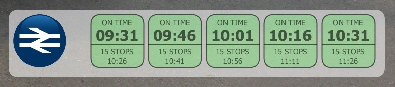
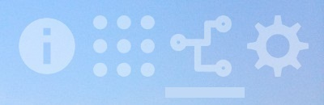

# **infoPAD**

An information and home control dashboard with digital picture frame capability.


# Contents
 - [General Info](#general-info)
 - [Technologies Used](#technologies-used)
 - [Setup](#setup)
 - [Features](#features)
 - [How It Works](#how-it-works)
 - [Known Issues](#known-issues)


# General Info

This is so far my favourite project I have worked on throughout 2020 during the COVID lockdowns and is based on an older dream of mine to have a "control centre" for the home. It has *evolved* to become a comprehensive information screen displaying, besides the current date and time, the weather, trains schedule, news headlines and incoming calendar events. It also connects to and can control my smart speaker, works like a digital picture frame, monitors devices connected to the network and can launch other apps.

It helped me learn a massive lot, especially about APIs as it relies on so many of them (Accuweather, BBC News Feed, National Rail, MET Alerts, Google Calendar and the BOSE smart speaker), but also about asynchronous queries, UX, modular design and transitions/animations.

The app runs in full screen on an older Lenovo Thinkpad Helix 2 Windows tablet which I have mounted on the wall in my kitchen. I have to say I am very proud of the end result, the code reflects my coding knowledge at that time and I am sure it can be considerably optimized and it's far from being perfect but the app has been continously running for years now requiring a restart every 2-3 months if it freezes, besides the occasional Windows update requiring a machine restart.

<figure>
  
</figure>
<br>

# Technologies Used

The app is coded entirely in [Processing 3.5.3](https://processing.org/) which is a fun to use, yet powerful language for learning how to code, aimed at artists, designers and hobbists.

Each of the external APIs is accessed using specific methods:
* Accuweather provides 12 hour and 5 days forecast in JSON format
* Weather alerts are retrieved from the UK's [MET Office's RSS feed](https://www.metoffice.gov.uk/public/data/PWSCache/WarningsRSS/Region/UK) in XML format.
* A [SOAP envelope](https://www.w3schools.com/xml/xml_soap.asp) is used to query [National Rail Enquiries](https://www.nationalrail.co.uk/) which returns UK train timetables in XML format.
* [Gradle](https://gradle.org/) is used to access the [Google Calendar API](https://developers.google.com/calendar/api/guides/overview) and calendar entries are exported in CSV format
* News are queried from the [BBC RSS Feed](http://feeds.bbci.co.uk/news/rss.xml?edition=uk) in XML format
* The BOSE Soundtouch smart speaker REST API is accessed directly using **http requests**.

The audio player module, app menu buttons and icons have been designed/created using [Inkscape](https://inkscape.org/).
<br><br>

# Setup

The source code is compiled into a Windows executable using the Processing IDE. The app uses a dedicated Google Account that has been configured with access to the Google calendar that is to be displayed, a shared note in Google Keeper and my Nest account.
<br><br>

# Features

<br>


Going clockwise from the top left corner:
* The current time, date and upcoming events retrieved from Google Calendar
* Menu bottons: About, External Apps Launcher, Connections Monitor and App Configuration
* BOSE Soundtouch smart speaker controller
* Trains timetable: next 5 trains on a predefined route e.g. home station to work
* Top 5 BBC news headlines
* Current weather, including rain probability, wind speed and humidity %. It changes to 12 hour and 5 day forecast when the module is touched.

The **External Apps Launcher** further extends the functionality by providing access to locally installed apps (Alexa, iTunes, VLC Player, etc.) and online services such as Google Nest and Keeper.

The background image works like a digital picture frame; it can display a static image or a slideshow of photos from either a local or remote repository. Images can be further organized in folders, so that specific slideshows run depending on the month or even the day.
<br><br>

# How It Works

* ## General Features

The app uses a configuration file containing settings for the services (including the access tokens for those APIs requiring them) and can be used to add/remove elements such as external apps or monitored devices. The file is read only when the app is launched and basic functionality is provided if the file is not accessible.

Events are saved in log files as follows:
- events for the current session (mostly time of API queries) which are cleared at app startup
- events related to the monitored devices, which include status of the devices when the app is launched and time and date for each time a device changes status.
- a more detailed app log is maintained if enabled in the configuration file. This details the initialization steps when the app starts, along with API queries, devices monitoring, etc.

Log files are saved locally and, if enabled in the configuration file, in a remote location.

The app monitors network and Internet connectivity, modules reacting accordingly when affected. For example, the smartspeaker controls continue to function when the Internet connection is down, as long as the local network connectivity is up. At the same time, sinca data from the external services is saved locally it will continue to be displayed until eventually it is no longer valid e.g. all trains from last successful query have departed.

The modules are configured to take up percentages of the screen, edges and font sizes are also relative to screen size, so the app should display correctly on most monitors but only in landscape mode. 
<br><br>

* ## The Calendar Module

The calendar entries are retrieved from Google Calendar's API using Gradle and are saved in a CSV file. This is a scheduled task that runs on a separate computer in my network. infoPad queries the CSV file every 5 minutes, copies its content locally and updates the information displayed. The module displays the next 10 calendar entries, but for repeating appointments it only displays the upcoming one.

<figure>
  
</figure>
<br>

The only interaction on this module is, when touching the calendar area, its background darkens to improve the contrast and make the calendar entries (that use a rather thin font) easier to read.

<figure>
  
</figure>
<br>

* ## The Weather Module

Two weather forecast queries are performed at app startup and then automatically, one at 5:01am to retrieve the 5 day forecast and at 1 minute past every hour to retrieve the 12 hour forecast. This is due to limitations of the terms of use of AccuWeather free API key allowing 50 API calls per day.

The module displays the current temperature and condition (sunny, rain, etc.) along with the specific icon (sun, cloud, moon, etc.) provided by Accuweather, the rain probability, wind speed and humidity %.

<figure>
  
</figure>
<br>

If there are any, the number of weather alerts reported by the UK MET office is displayed within a red circle in the bottom right corner of the module. When this is clicked, the MET alerts web page opens in a full screen, kiosk mode Google Chrome.

Clicking on the weather module once causes it to fade into the 12 hour forecast. Clicking again will fade into the 5 day forecast. These return to the normal view upon another click or after a 30 seconds timeout.

<figure>
  
  
</figure>
<br>

* ## The News Module

BBC News RSS feed is queried every 60 seconds, the XML is parsed and first 5 headlines (title and short descriptions) are extracted and displayed each for 10 seconds.

<figure>
  
</figure>
Transition between the news articles is done with the current article fading out while the next one fades in.
<br><br>

Clicking on the BBC News Logo will open the news website in full screen kiosk mode Google Chrome. Clicking the news article will "hold it" in place allowing more time for reading and clicking the logo will open the news article itself in Chrome.

<figure>
  
</figure>
<br>

* ## The Trains Timetable Module

Train information is queried every 60 seconds from the National Rail Service using a [SOAP envelope](https://www.w3schools.com/xml/xml_soap.asp). The request is for retrieving the next 5 trains arriving at the specified station (home station) with a filter for a specified destination.

The information displayed for each train contains the arrival time, status (or initial arrival time for late trains), number of stops and the estimated arrival time at the destination.
<figure>
  
</figure>

Colour coding is used to show train status:
- ON TIME trains are displayed using <font color="green">green</font>
- CANCELLED and DELAYED (unknown arrival time) trains are displayed using <font color="red">red</font>
- LATE trains are displayed using <font color="tan">yellow-ish</font>, along with the expected time
<br>

<figure>
  
</figure>

The entries are displayed in a carousel, the first train fading out when its arrival time has passed while all the others are sliding left and a new entry, if such exists, fades in at the back.

A message is displayed if there are no trains available or train information cannot be queried.
<br><br>

* ## Smart Speaker Control Module

The app connects to my BOSE Soundtouch 20 REST API to retrieve its status every 3 seconds. The http requests are sent using cURL commands.<br><br>

When the speaker is in standby, the player sits offscreen with only the power button visible. When the power button is pressed or the speaker becomes active, the module slides in but can also be "sent back" using the minimize button underneath the power button.<br>
<figure>
  
</figure>
<br>

The power button reflects the status of the speaker:
<figure>
  
  
  <br>
  <b>no colour</b>: speaker is in standby<br>
  <b>steady green</b>: speaker is on<br>
  <b>blinking green</b>: in the process of turning on/turning off<br>
  <b>steady red</b>: the app cannot connect to the speaker<br>
  <b>blinking red</b>: the app is trying to connect to the speaker
</figure>
<br>

The jog dial can be used to mute/unmute or pause/unpause (press), control the volume (push up/down) and skip to next/previous track (push left/right). When the player is muted or paused, the jog dial's colour changes to red.
<figure>
  
  
</figure>
<br>

Additionally, the volume can be turned up/down by dragging a finger vertically within the right half of the screen.<br><br>

The player's main display shows information about the current source like Amazon Music, Local Music, Bluetooth, AirPlay etc. or the name of the radio station. The smaller icons show additional information such as whether the station is in the list of favourites, whether a track, album or playlist is currently playing, shuffle and/or repeat is on, etc.<br><br>

The 6 presets can be accessed using the button above the jog dial. Holding a preset pressed for longer than 3 seconds replaces it with the current source:
<figure>
  
</figure>
<br>

A "clean filter" is on by default, meaning that the player will try and skip tracks marked as explicit. This can be turned off by right-clicking/touching for 3+ seconds the presets button. Status is shown with a small icon in the player's main display:
<figure>
  
  
  <br>
  C inside a green circle: the filter is on<br>
  C inside a grey circle: the filter is off with no explicit track is playing at the moment<br>
  E inside a red circle: the filter is off and a track marked as explicit is currently playing
</figure>
<br>

Touching the main display reveals the shuffle and repeat controls, if they are available for the current content.
<br><br>

An information panel pops up if details are available for the currently playing content:
<figure>
  
  <figcaption>Radio station broadcasting the show's name and image</figcaption>
</figure><br>

<figure>
  
  <figcaption>Radio station broadcasting its slogan</figcaption>
</figure><br>

<figure>
  
  <figcaption>Track of an album playing from local music</figcaption>
</figure><br>

Skipping to next/previous tracks can also be done by dragging with the finger horizontally over the pop-up track information panel.<br><br>

* ## Digital Picture Frame

The app uses a default static image and can be further configured to use images from a local or remote repository. The files can be organized in folders by month and even days and will be displayed accordingly, for example on the 5th of November the app will look for photos in the ./11/05 folder. If there's no such content, it will look into ./11 folder, and if there's still nothing then the photos in the root of the repository will be used. If all these fail, the default image is used.<br><br>

Each time the app is started and every time at midnight, the app loads each of the qualifying images and saves the screens in a local folder. This ensures the files are loaded faster during the day, having the same resolution as the screen and the edges cropped out to match the screen's aspect ratio.

This process can be manually started from the Configuration menu (the REFRESH button), useful if there are changes in the repository.<br><br>

Further settings are available in the <b>Configuration</b> menu:
- change the slideshow timing
- turn off the slideshow
- change to next/previous image
- switch to using no image but a black background

<figure>
  <br>
  The name of the currently displayed image is shown at the bottom of the Configuration menu.
</figure>
<br><br>

* ## Monitoring Network Devices and Services

The module is accessed via the button from the app's menu:
<figure>
  
</figure>
<br>

Devices and services are added in the **config.ini** file. While the player, server and router have their dedicated sections with specific settings (e.g. ports and protocol), any other devices are added as **[DEVICE]** along with a `display name`, the `IP address`, its `kind` and `ignore` settings.

```
[PLAYER]
name=SoundTouch
protocol=http
ip_address1=192.168.1.50
ip_address2=192.168.1.150
port=8090
[SERVER]
name=HomeServer
ip_address=192.168.1.10
[ROUTER]
name=Internet
ip_address=192.168.1.1
[DEVICE]
ip_address=192.168.1.11
name=HomeNAS
kind=nas
ignore=false
[DEVICE]
ip_address=192.168.1.21
name=Front
kind=camera
ignore=true
[DEVICE]
ip_address=192.168.1.22
name=Side
kind=camera
ignore=false
```
<br>

The `kind` determines which device icon to use, for example setting `kind = speaker` will use the available `speaker.png` icon for the device. If a corresponding icon doesn't exist in the ./ico/devices/ folder, a default `unknown.png` is used.
<br><br>

The app checks the devices at startup and every 60 seconds afterwards by sending `ping` commands. Connection status is reflected by the background colour of the monitored devices icons:
<figure>
  
</figure>
The icon's background colour indicates the status of the device:
<font color="green">green</font> means the device is online, <font color="red">red</font> means the device is offline and has a <code>ignore=false</code> setting, 
<font color="amber">amber</font> means the device is offline, but has a <code>ignore=true</code> setting.
<br><br>

An alert is also shown next to the menu button if there are any devices reported as offline and set not to be ignored:
<figure>
  
</figure>
<br>

Status of the devices at application startup and all status changes are recorded in the `devices.log` file. If **full log** is activated, these will also be recored in the `app.log`.
<br><br>

* ## External Apps

The External Apps module is accessible via the menu button and makes it easy to launch other apps or open web services from within the app.
<figure>
  
</figure>
<br>

Apps are added in the **config.ini** file in **[APP]** sections, along with a `name`, `icon file name` and `command`:
```
[APP]
name=Alexa
icon=alexa.png
run=start shell:AppsFolder\57540AMZNMobileLLC.AmazonAlexa_22t9g3sebte08!App
[APP]
name=Nest
icon=nest.png
run="C:\Program Files (x86)\Google\Chrome\Application\chrome.exe" --kiosk https://home.nest.com/home/*device-ID-here*
[APP]
name=SoundTouch
icon=stouch.png
run="C:\Program Files (x86)\SoundTouch\SoundTouch.exe"
[APP]
name=VLC
icon=vlc.png
run="C:\Program Files\VideoLAN\VLC\vlc.exe"
[APP]
name=Keep
icon=keep.png
run="C:\Program Files (x86)\Google\Chrome\Application\chrome.exe" --kiosk https://keep.google.com/u/0/#LIST/*list-ID-here*
```
<br>
The `name` will be used for the app's entry along with the `icon` file which should be present in the ./ico/xapps/ directory, otherwise `blank.png` is used as it's the case with iTunes in this screenshot:
<figure>
  
</figure>
<br>

The `run` setting should be the exact command used to open the corresponding app from a command prompt. It can point to the app's executable (SoundTouch and VLC in this case) or launch the app from the AppsFolder, as its the case with apps installed from Microsoft Store such as Alexa in the above example. Nest and Keep will open the corresponding web services using Google Chrome in kiosk mode.
<br><br>

* ## Other Features

By default, the app is set to <font color="green">AUTO DIM: AT NIGHT</font>, which dims the screen automatically at 11:00pm. From the <b>Configuration</b> menu, this can be changed to <font color="green">AUTO DIM: ON</font> which dims the screen after 10 minutes of inactivity, or to <font color="red">AUTO DIM: OFF</font> which disables the feature. Dimming is done at OS level, using a powershell command which sets the display brightness to 10%. Touching the screen will launch the command that sets the screen's brightness to 100%.
<figure>
  
</figure>
<br><br>

Some information is displayed for a few seconds as overlay text in the upper right corner. For example, the current volume level is displayed when that's changed from within the app by sliding the finger vertically on the screen:
<figure>
  
</figure>
<br><br>


The <b>Info</b> button displays the app version, copyright information and time when trains and news information was last successfully queried.
<figure>
  
</figure>

## Known Issues
- the Player module sometimes fails to display information about what's currently playing, or uses the artwork from the previous source. This doesn't happen very often and it's more probably caused by a lag when retrieving the information from the smart speaker combined with Processing's way of dealing with async operations.
- the Calendar module is not working at the moment due to a problem with the script outside the app that fails to return any results from Google Calendar's API. It's something I plan looking into very soon.
